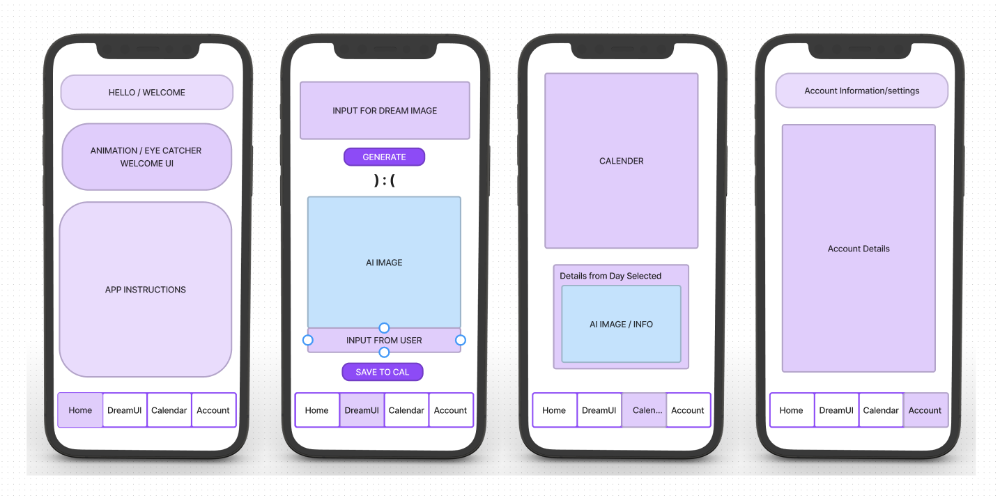
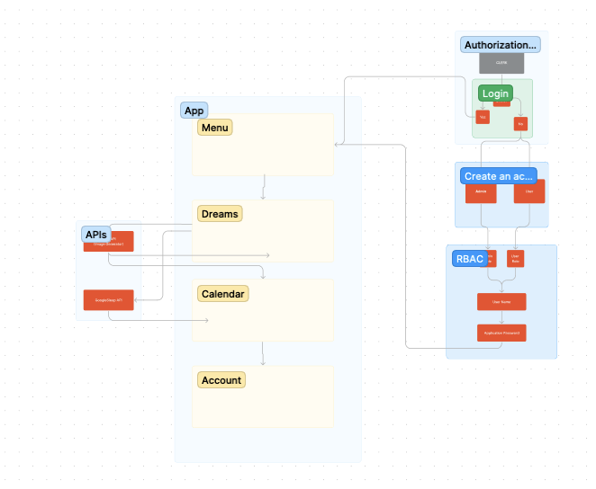
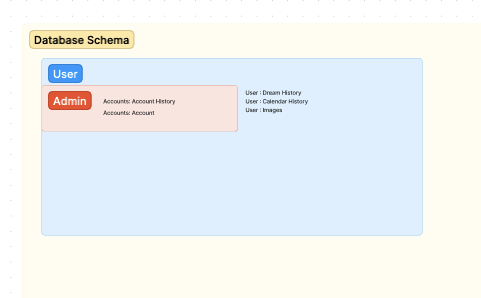
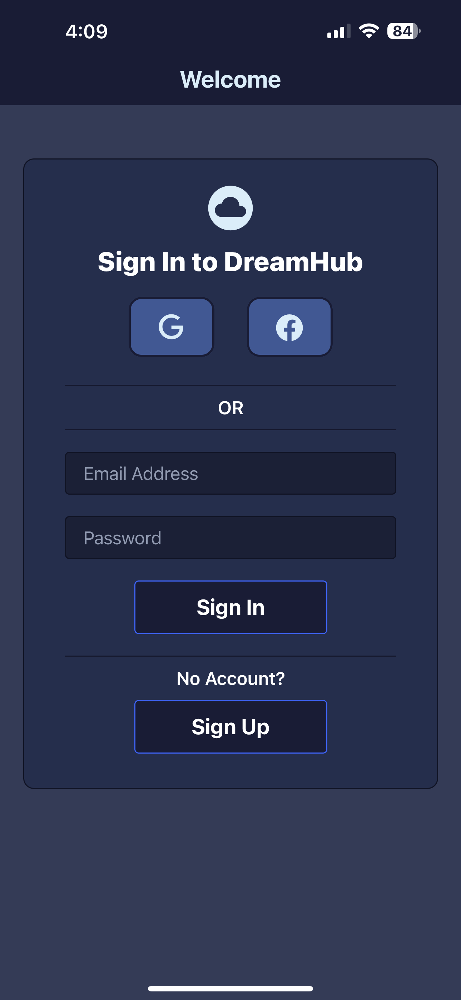
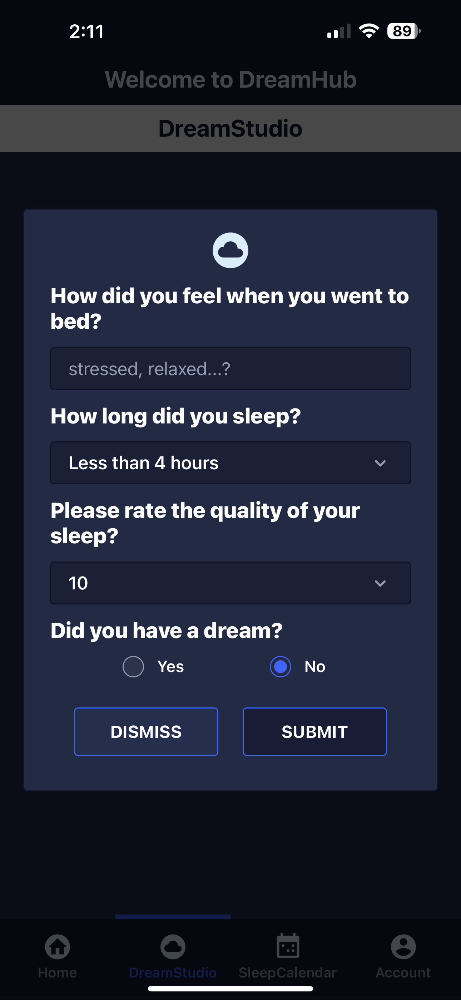
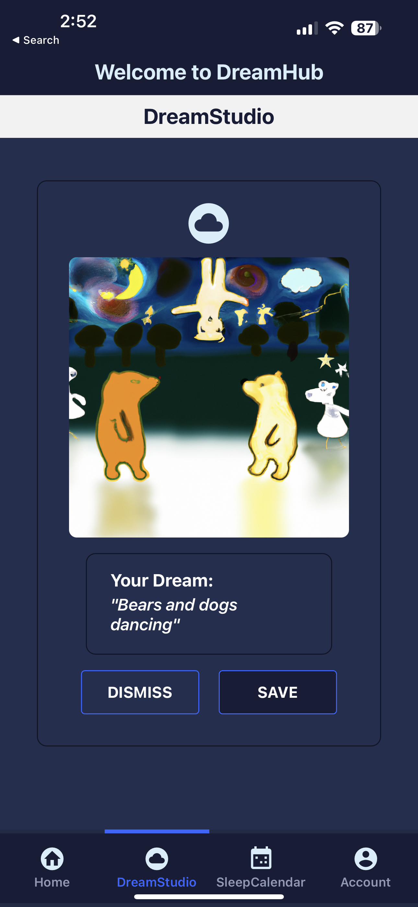
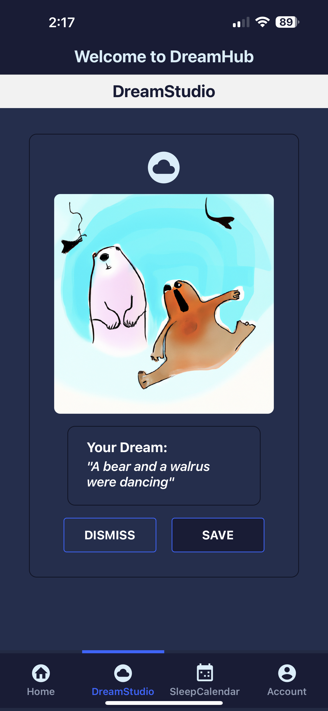

# DREAMHUB

<!-- # CODENAME: DREAMCATCHER -->

## Project Team

- [Zoe Gonzalez]()
- [Julian Barker]()
- [Dustin Apodaca]()
- [Raphael Chookagian]()
- [Megan Faith Seibert-Hughes]()

## Problem Domain

DreamHub allows users to keep track of what goes on in their subconscious minds while sleeping. The power of AI allows users to generate an AI image of their journal entries or dreams upon rising. The app also provides useful sleep tips and recommendations and keeps track of sleeping patterns and dreams through the year on a calender.

## UMLs

## Links

### Project DreamCatcher

[Github](https://github.com/DJRMZ/DreamCatcher)

[Trello Board](https://trello.com/b/mMaqS3zv/dreamers)

[Whiteboard | UML](https://www.figma.com/file/QyzI6kh0zmEUBHKJB7KrFX/Project-DreamCatcher?node-id=0%3A1&t=Ox0v8YmWvbhF9jum-0)

### Documentation

[Cooperation](./documentation//cooperation.md)

[Project](./documentation//project.md)

[References](./documentation//references.md)

[Software Requirements](./documentation//software_req.md)

### Technologies Used

[React Native](https://reactnative.dev/docs/environment-setup)

[Expo](https://docs.expo.dev/)

[Clerk](https://clerk.dev/docs/quickstarts/get-started-with-expo)

[Supabase](https://supabase.com/docs/guides/getting-started/tutorials/with-expo)

[tailwind](https://tailwindcss.com/docs/installation)

[nativewind](https://www.nativewind.dev/)

## Features

1. Users can signup, signin to their account through the application using clerk for authentication. Users can also logout at anytime from the account screen.

2. Once signed in, users will have access to thier account with their journal entries and images they create. Images and entries will be saved to a database to store and be available to the user.

3. Users are able to save sign in information and stay logged into the application. Users will not see content unless they are signed into the application.

4. Users can use DreamStudio to create AI generated images from user input and dream descriptions. Images can be saved to our database and are shown in the calendar component.

5. Users can share their images through text and/or other compatible applications.

## Tests

## Change Log

## Credit and Collaborations

### Auth

Clerk - Authentication Provider - [Docs](https://clerk.dev/docs)

clerk-expo-starter - [Repo](https://github.com/clerkinc/clerk-expo-starter)

t3-turbo-and-clerk - [Repo](https://github.com/clerkinc/t3-turbo-and-clerk)

clerk-supabase - [Repo](https://github.com/clerkinc/clerk-supabase)

### BaaS

supabase - [Docs](https://supabase.com/docs)

## Structure

react-navigation - React Native navigation and routing - [Docs](https://reactnavigation.org/docs)

NativeBase - component library - [Docs](https://docs.nativebase.io)

## Styling

NativeWind - ReactNative port of TailwindCSS - [Docs](https://www.nativewind.dev)

TailwindCSS - Utility-first styling library - [Docs](https://tailwindcss.com/docs)

## Dream / Sleep Mobile App with AI intergration

1. What problem or pain point does it solve? a. Keep it high level without going into too much detail. (3-4 sentences is enough)

- Our sleep / dream app will allow users to keep track of what goes on in their subconscious minds while sleeping and allow them generate an AI image of their journal entries or dreams upon rising. The app may also be able to provide useful sleep tips and recommendations and keep track of their sleeping patterns and dreams through the year on a calander.

2. Minimum Viable Product (MVP) definition.

- Authentication and Authorization
  - Login, Sign Up, Account, ACL, DB and bucket integration
- API integration (openAI)
- Clean UI/UX
- Functional and fully designed front-end components
-

3. Stretch goals

- Sleep API's (Google)
- Extra features
  - Sleep tracking
  - Sleep tips
  - Sleep journals to saved to account
  - Stored dream entries along with calander tracking

4. What is the minimum required for you to present on your demo day?

- MVP
